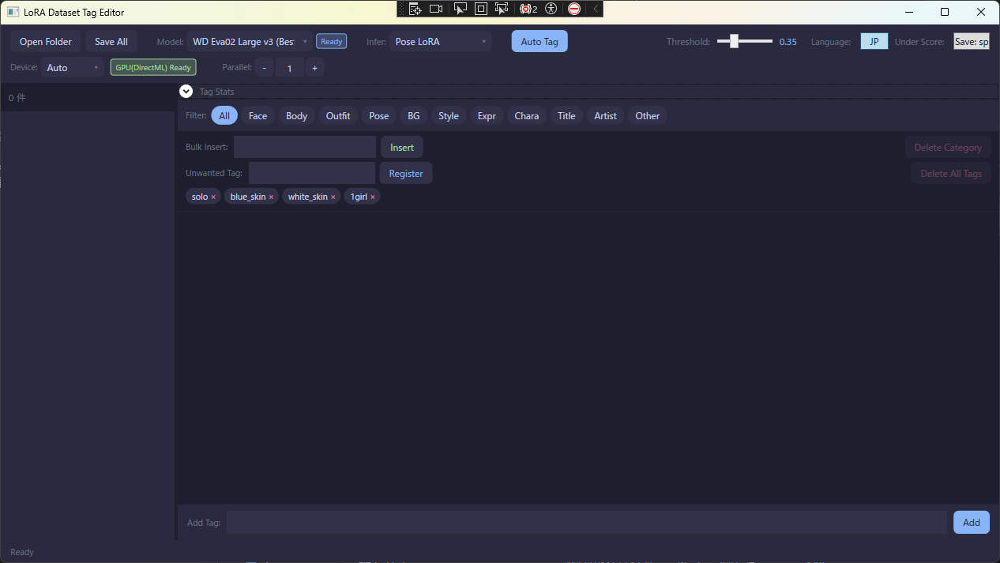
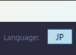
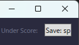

# TagFilter - LoRA Dataset Tag Editor

WD14 Tagger を使って画像に自動でタグを付け、LoRA学習用データセットを効率よく作成・編集するツールです。

[English README](README.md)

---



---

## 更新履歴

### v1.2.3
- タグ分類カテゴリの大幅見直し

### v1.2.2
- 画像ごとに**タグをクリップボードにコピー**するボタンを追加
- **.txtファイル出力のON/OFF**切替を追加
- フォルダだけでなく**画像ファイル単体**でのドラッグ&ドロップに対応

### v1.2.1
- タグ付けエラー時に例外の種類とスタックトレースを表示するよう改善

---

## 動作環境

- Windows 10 / 11
- .NET Framework 4.8.1（Windows標準搭載）
- DirectX 12 対応GPU推奨（NVIDIA / AMD / Intel 全対応）、CPUでも動作可

---

## 主な機能

### 自動タグ付け

WD14 Tagger（ONNX）で画像を解析し、タグを自動生成します。結果は同名の `.txt` ファイルに自動保存されます。

- 左側の一覧で複数選択した場合は選択画像のみが対象、未選択なら全画像が対象
- **閾値スライダー**（デフォルト 0.35）でタグの検出感度を調整

### ドラッグ&ドロップ

画像**フォルダ**または**画像ファイル単体**をウィンドウに直接ドロップして読み込めます。画像ファイルを1枚ドロップした場合は、そのファイルが入っているフォルダ全体を読み込みます。


### モデル選択

| モデル | サイズ | 特徴 |
|---|---|---|
| WD ViT v2（標準・軽量） | 約365MB | 標準的なアニメ・イラスト向け |
| WD SwinV2 v2（高精度） | 約365MB | v2系の高精度版 |
| WD ViT v3（実写向け改善） | 約365MB | 実写写真にも対応 |
| WD ViT Large v3（高精度） | 約1.2GB | v3大型・高精度 |
| WD Eva02 Large v3（最高精度） | 約2.5GB | v3最大・最高精度 |

未ダウンロードのモデルは初回選択時に自動ダウンロードされます。

### 推論カテゴリ（LoRAモード）

タグ付け結果を目的のカテゴリに絞り込めます。

| 番号 | モード |
|---|---|
| 0 | 全タグ（絞り込みなし） |
| 1 | 顔 LoRA |
| 2 | 服装 LoRA |
| 3 | 体 LoRA |
| 4 | ポーズ LoRA |
| 5 | 背景 LoRA |
| 6 | スタイル LoRA |
| 7 | 表現 LoRA |
| 8 | 作者名 |
| 9 | キャラクター |
| 10 | 作品名 |

### GPU / 並列処理

- **デバイス**：自動 / GPU（DirectML）/ CPU を切替可能
- **並列数**：CPU使用時はコア数に合わせて並列処理数を増やすと高速化
- GPU（DirectML）使用時は並列数1固定（DirectMLの仕様）

### 言語切替

右上の **Language** ボタンで日本語／英語を切り替えられます。設定は自動保存されます。



### アンダースコアの有無

**Under Score** ボタンでタグの `.txt` ファイルへの保存形式を切り替えられます。

| 設定 | 保存形式 |
|---|---|
| 保存: _ あり | `brown_hair, long_hair` |
| 保存: スペース | `brown hair, long hair` |

> 注意：アプリ内部ではアンダースコア付きで管理されます。画面上の表示は常にアンダースコアあり表記で、保存される `.txt` ファイルのみ変換されます。最近のLoRA学習ではスペース区切りが主流になっています。



### タグ集計パネル

フォルダ内の全タグを件数付きで一覧表示。件数順・名前順の並び替えが可能。タグをクリックして「**選択タグを全削除**」で一括削除できます。

### 表示フィルタ

`すべて` / `顔` / `体` / `服装` / `ポーズ` / `背景` / `スタイル` / `表現` / `キャラ` / `作品名` / `作者` / `その他`

カテゴリで表示を絞り込み、特定カテゴリのタグをまとめて削除することもできます。

### タグの一括操作

- **一括挿入**：全画像（または選択画像）に同じタグを追加
- **一括削除**：指定タグを全画像から削除
- **不要タグ登録**：よく削除するタグをチップとして保存。次回からワンクリックで削除対象にセット

### タグをクリップボードにコピー

画像一覧の各行にある **Copy Tags** ボタンをクリックすると、その画像のタグをカンマ区切りでクリップボードにコピーします。アンダースコア設定に連動します。

### .txtファイル出力のON/OFF

ツールバーの **Save .txt** ボタンで `.txt` ファイルへの書き出しを切り替えられます。OFFにするとタグはメモリ上のみで保持され、ファイルは更新されません。

### 設定の自動保存

モデル・デバイス・閾値・言語・アンダースコア設定・.txt出力設定・不要タグ一覧などは終了時に `settings.xml` へ自動保存されます。

---

## コマンドライン・バッチ処理

引数を指定して起動することで、タグ付けを自動実行して終了するバッチ処理ができます。

```
TagFilter.exe <フォルダパス> [LoRAモード番号] [挿入タグ]
```

| 引数 | 必須 | 説明 |
|---|---|---|
| 引数1 | ○ | 画像フォルダのパス |
| 引数2 | △ | LoRAモード番号（0〜10、省略時はsettings.xml値） |
| 引数3 | △ | 一括挿入タグ（カンマ区切りで複数指定可、省略可） |

引数を1つでも指定した場合、タグ付け完了後に自動終了します。

**バッチファイル例：**

```bat
@echo off
TagFilter.exe "E:\dataset\chara_A" 1 "masterpiece,best_quality"
TagFilter.exe "E:\dataset\chara_B" 1 "masterpiece,best_quality"
TagFilter.exe "E:\dataset\chara_C" 2
```

---

## インストール

1. [Releases](https://github.com/unaya-git/TagFilter/releases/latest) から最新の `TagFilter_vX.X.X.zip` をダウンロード
2. 任意のフォルダに展開して `TagFilter.exe` を実行

インストール不要・レジストリ書き込みなし。アンインストールはフォルダごと削除するだけです。

---

## 利用モデルについて

[SmilingWolf](https://huggingface.co/SmilingWolf) 氏が公開している WD14 Tagger モデルを使用しています。モデルは初回使用時にHugging Faceから自動ダウンロードされます。

---

---

## LoRA作成

kohya_ssを使ったLoRA学習機能が内蔵されています。右パネルの **Train LoRA** タブに切り替えて使用します。

### 動作環境

- kohya_ssがローカルにインストールされていること（通常インストール・StabilityMatrix両対応）
- SDXLベースモデル（.safetensors）
- VRAM 12GB推奨（RTX 4070 / 4080 / 5070 等）

### 設定（Pathsタブ）

| 項目 | 説明 |
|---|---|
| kohya_ss folder | kohya_ssのルートフォルダ（`venv/` と `sd-scripts/` が入っているフォルダ） |
| pretrained_model | SDXLベースモデルのパス（.safetensors） |
| output_dir | 学習済み.safetensorsの出力先フォルダ |
| output_name | 出力ファイル名（拡張子なし） |
| repeats | 1epochあたりの画像繰り返し回数 |

学習データはメインウィンドウで開いているフォルダが使用されます。kohya_ssが要求するサブフォルダ構造（`repeats_name/`）はアプリが自動で作成するため、手動でフォルダを準備する必要はありません。

### プリセット

| プリセット | 対象 | VRAM目安 |
|---|---|---|
| Anime SDXL | イラスト・アニメ系 | 約10GB |
| Photo SDXL | 実写写真系 | 約10GB |

両プリセットとも `gradient_checkpointing=true` に設定しており、VRAM 12GB以内で学習できます。

### パラメータタブ

- **Network** — network_dim、network_alpha、エポック数、バッチサイズ、解像度
- **LR** — learning_rate、unet_lr、text_encoder_lr、スケジューラ
- **Optimizer** — optimizer_type、mixed_precision、save_precision
- **Advanced** — noise_offset、min_snr_gamma、shuffle_caption、keep_tokens、clip_skip

設定はウィンドウを閉じると自動保存され、次回起動時に復元されます。

### コマンドライン・バッチ処理でのLoRA作成

引数5にLoRAのoutput_nameを指定すると、タグ付け完了後に自動的にLoRA学習を開始します：

```
TagFilter.exe <フォルダ> [LoRAモード] [挿入タグ] [""] [LoRA出力名]
```

| 引数 | 説明 |
|---|---|
| 引数5 | LoRA出力名 — 指定するとタグ付け後にLoRA学習を実行。パス・パラメータは `lora_settings.xml` から読み込み |

**バッチファイル例：**
```bat
@echo off
TagFilter.exe "E:\dataset\chara_A" 1 "" "" "chara_a_lora"
TagFilter.exe "E:\dataset\chara_B" 1 "" "" "chara_b_lora"
```

---

## ライセンス

[MIT License](LICENSE.txt)

使用ライブラリ：[Microsoft.ML.OnnxRuntime.DirectML](https://github.com/microsoft/onnxruntime)（MIT）／[OpenCvSharp4](https://github.com/shimat/opencvsharp)（Apache 2.0）／[Costura.Fody](https://github.com/Fody/Costura)（MIT）
